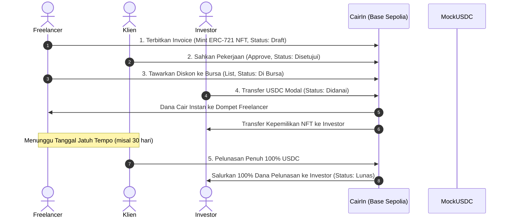
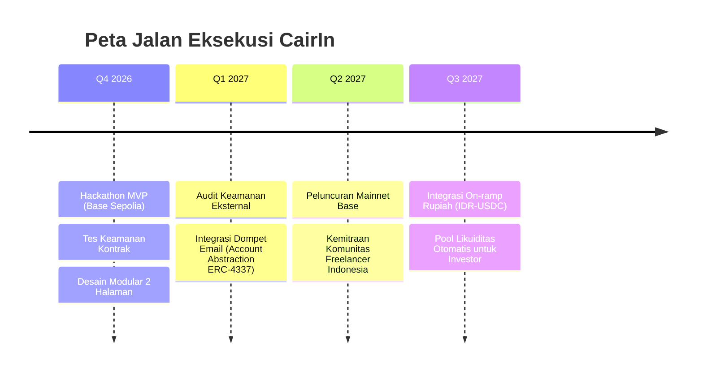

# 📑 PITCH DECK: CAIRIN
**Platform Pembiayaan Invoice Freelancer (RWA Factoring) di Jaringan Base Sepolia**  
*Ethereum Jakarta Hackathon 2026*

---

## Slide 1: Cover & Pengenalan Produk

### **CAIRIN**
> **"Ubah Piutang 30 Hari Menjadi Kas Hari Ini. Tanpa Bunga, Tanpa Ribet."**

* **Kategori:** Real-World Assets (RWA) & Decentralized Factoring
* **Jaringan:** Base Sepolia (Ethereum Layer-2)
* **Aset Settlement:** USDC Stablecoin
* **Standar Kontrak:** ERC-721 (Non-Fungible Token) + ERC-20
* **Repositori GitHub:** [syifamwlda/Cashin](https://github.com/syifamwlda/Cashin)

---

## Slide 2: Masalah Utama (The Problem)

### **Krisis Arus Kas 30–90 Hari Bagi Pekerja Lepas**

1. **Jatuh Tempo Pembayaran yang Panjang (*Payment Terms Lag*):**  
   Freelancer dan agensi kreatif di Indonesia sering harus menunggu termin pembayaran klien selama **30 hingga 90 hari** setelah pekerjaan selesai.
2. **Tidak Ada Akses Pembiayaan Tradisional (*Underbanked*):**  
   Perbankan konvensional menolak anjak piutang (*factoring*) untuk freelancer karena tidak adanya agunan aset fisik dan besaran tiket invoice yang dianggap terlalu kecil (*micro-ticket*).
3. **Jeratan Pinjaman Online (*Predatory Loans*):**  
   Untuk menutupi biaya operasional bulanan, banyak pekerja lepas terpaksa menggunakan pinjol berbunga mencekik (hingga 20–30% per bulan).
4. **Risiko Penipuan Faktur Ganda (*Double-Invoicing Fraud*):**  
   Pada pembiayaan tagihan tradisional, pemodal menghadapi risiko besar vendor nakal menjual 1 invoice yang sama ke beberapa institusi keuangan berbeda.

---

## Slide 3: Solusi Kami (The Solution)

### **Anjak Piutang On-Chain Berbasis Real-World Asset (RWA)**

CairIn menghadirkan platform pasar likuiditas terdesentralisasi yang mempertemukan **Freelancer**, **Klien**, dan **Investor**:

* **Tokenisasi Hak Tagih (ERC-721 NFT):**  
  Setiap invoice yang disahkan klien dicetak menjadi sertifikat digital NFT unik di blockchain Base Sepolia.
* **Pencairan Instan di Muka (*Instant Payout*):**  
  Freelancer menjual invoice dengan potongan diskon wajar (misal: diskon 8%) kepada investor, dan menerima dana cair detik itu juga.
* **Bukan Pinjaman Berbunga (*Zero Debt*):**  
  Transaksi merupakan jual-beli hak tagih murni. Freelancer tidak memiliki kewajiban cicilan bulanan atau bunga berjalan.
* **Imbal Hasil Nyata untuk Investor (*Real RWA Yield*):**  
  Investor memperoleh imbal hasil 8%–15% APY yang didukung oleh pekerjaan nyata, bukan inflasi token spekulatif.

---

## Slide 4: Bagaimana Cara Kerjanya (Product Workflow)



---

## Slide 5: Inovasi Keamanan — Proteksi Piutang Ganda

### **State Machine Atomik pada Smart Contract**

Inovasi utama CairIn adalah **penghapusan total risiko pendanaan ganda** menggunakan state machine kontraktual di Base Sepolia:

| Tahap Status | Kondisi Hak Tagih | Validasi Keamanan Smart Contract |
| :--- | :--- | :--- |
| **0. Draft** | Tagihan baru dibuat freelancer | Belum bisa didanai investor (mencegah invoice fiktif). |
| **1. Disetujui** | Klien mengesahkan keabsahan pekerjaan | Siap diberi diskon penawaran. |
| **2. Di Bursa** | Terdaftar aktif di pasar pembiayaan | Hanya status ini yang dapat menerima dana investor. |
| **3. Didanai** | Investor mentransfer USDC | **Status TERKUNCI permanen.** Pemilik NFT berpindah ke investor. |
| **4. Lunas** | Klien membayar termin jatuh tempo | Kontrak selesai tuntas. |

> [!IMPORTANT]
> **Garansi Kode On-Chain:** Fungsi `fundInvoice` secara ketat mewajibkan `require(inv.status == InvoiceStatus.Listed)`. Begitu seorang investor mendanai, status seketika terkunci ke `Financed`. Setiap transaksi susulan dari pihak lain pada invoice yang sama **otomatis ditolak (revert) oleh EVM**, menjamin saldo investor aman 100%.

---

## Slide 6: Analisis Pasar & Peluang (Market Opportunity)

### **Ledakan Gig Economy & Gelombang RWA di Asia Tenggara**

* **140 Juta+ Pekerja Informal & Digital di Asia Tenggara:**  
  Indonesia merupakan pasar pekerja lepas digital terbesar di ASEAN dengan transaksi jasa jutaan dolar per tahun.
* **Pertumbuhan Real-World Assets (RWA):**  
  Sektor RWA diproyeksikan mencapai kapitalisasi pasar multi-triliun dolar pada 2030. Investor Web3 kini beralih dari yield spekulatif ke instrumen berpenghasilan riil (*private credit receivables*).
* **Solusi Finansial Lintas Batas:**  
  Dengan stabilnya USDC di Base, freelancer lokal dapat menerima pembiayaan dari investor global tanpa potongan valuta asing atau birokrasi lintas negara.

---

## Slide 7: Model Bisnis & Keberlanjutan (Business Model)

CairIn memiliki model pendapatan transparan tanpa membebani arus kas freelancer:

1. **Biaya Protokol Transaksi (*Origination Fee*):**  
   Potongan kecil sebesar **0,5% – 1%** dari total nominal invoice saat pencairan dana sukses.
2. **Biaya Penatausahaan Pelunasan (*Settlement Fee*):**  
   Biaya platform sebesar **0,25%** saat klien melunasi tagihan di smart contract.
3. **Layanan Verifikasi Bisnis Premium (*Verified Enterprise SLA*):**  
   Paket langganan bagi agensi dan korporasi untuk integrasi otomatisasi ERP / API faktur pajak.

---

## Slide 8: Keunggulan Kompetitif (Competitive Advantage)

| Parameter Komparasi | Anjak Piutang Tradisional (Bank/Multifinance) | Pinjol / P2P Lending | **CAIRIN (RWA Web3)** |
| :--- | :--- | :--- | :--- |
| **Waktu Pencairan** | 2–4 minggu proses berkas | 1–3 hari kerja | **Detik (Instan di Blockchain)** |
| **Beban Finansial** | Bunga + biaya penalti keterlambatan | Bunga bulanan tinggi (15–30%) | **Bukan utang (Diskon jual-beli wajar)** |
| **Agunan Fisik** | Wajib sertifikat aset/tanah | Data pribadi / BI Checking | **Tanpa agunan (Didukung verifikasi klien)** |
| **Proteksi Penipuan** | Verifikasi manual kertas (rawan fraud) | Terbatas pada skor kredit | **Kriptografis (ERC-721 State Guard)** |
| **Biaya Transaksi** | Mahal (biaya notaris & administrasi) | Bunga tinggi | **< Rp100 per transaksi di Base Sepolia** |

---

## Slide 9: Arsitektur Teknologi (Tech Stack)

```
┌─────────────────────────────────────────────────────────────┐
│                       FRONTEND LAYER                        │
│   Next.js 16 (App Router) • TypeScript • Vanilla Brutalist  │
│       Wagmi v2 • Viem • Plus Jakarta Sans & JetBrains       │
└──────────────────────────────┬──────────────────────────────┘
                               │ JSON-RPC
┌──────────────────────────────▼──────────────────────────────┐
│                    BASE SEPOLIA LAYER-2                     │
│  Gas Fee Rendah (< $0.01) • Finalitas Sub-Detik • EVM Eq.   │
├─────────────────────────────────────────────────────────────┤
│                    SMART CONTRACT LAYER                     │
│  • CairIn.sol (ERC-721 Receivable Certificate & Factoring)  │
│  • MockUSDC.sol (ERC-20 6-Decimals Liquidity Settlement)    │
│  • OpenZeppelin ReentrancyGuard & Ownable Controls          │
└─────────────────────────────────────────────────────────────┘
```

---

## Slide 10: Rencana Pengembangan (Roadmap)



---

## Kontak & Tautan Proyek

* **Platform Live Demo:** `http://localhost:3000`
* **Halaman Workspace:** `http://localhost:3000/app`
* **GitHub Repository:** [https://github.com/syifamwlda/Cashin](https://github.com/syifamwlda/Cashin)
* **Smart Contract Testnet:** Base Sepolia Testnet
